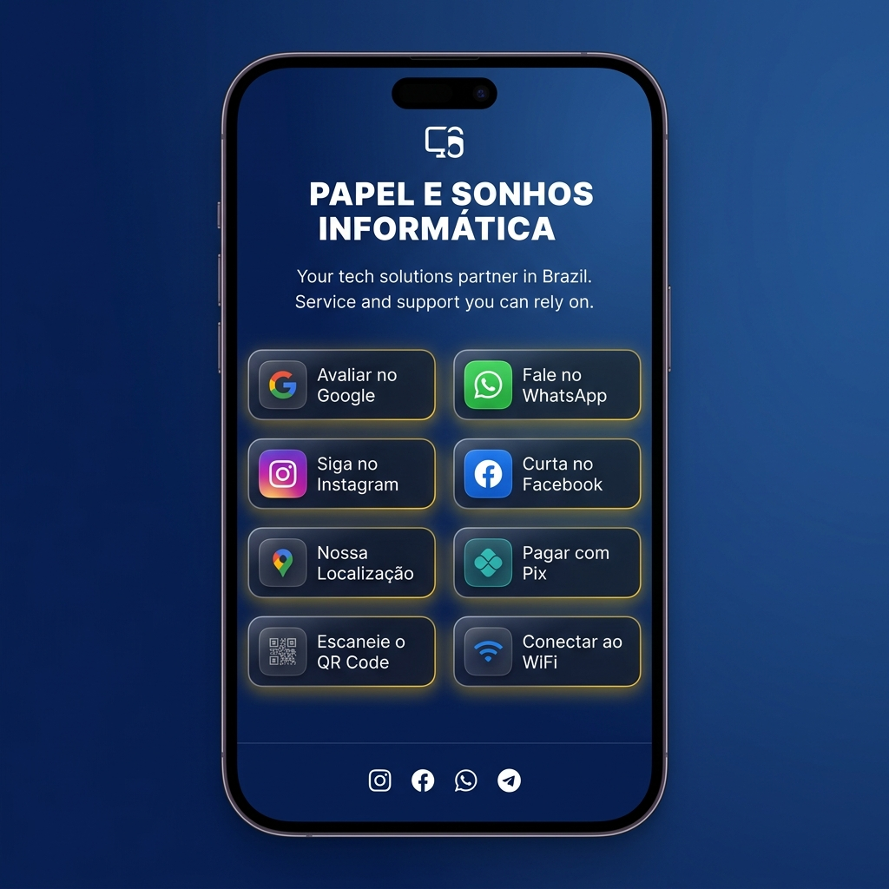

<div align="center">

# 📄 Papel e Sonhos Connect

**Landing page profissional para a Papel e Sonhos Informática**  
*Conecte seus clientes ao seu negócio com um clique!*

[](https://papel-e-sonhos-connect.vercel.app/)
[](LICENSE)
[](index.html)
[](style.css)
[](script.js)



🌐 **[Acessar o Site](https://papel-e-sonhos-connect.vercel.app/)** &nbsp;|&nbsp; 💬 **[Falar no WhatsApp](https://wa.me/5521987172463)**

</div>

---

## 📖 Sobre o Projeto

O **Papel e Sonhos Connect** é uma **landing page** (página de apresentação) criada para a loja **Papel e Sonhos Informática**, localizada no Rio de Janeiro. Ela funciona como um cartão de visita digital — com todos os contatos e recursos importantes em um só lugar.

### O que o cliente pode fazer na página?

| Botão | Função |
|-------|--------|
| ⭐ **Avalie no Google** | Abre o link para deixar uma avaliação no Google Maps |
| 💬 **WhatsApp** | Inicia uma conversa direto no WhatsApp da loja |
| 📸 **Instagram** | Acessa o perfil do Instagram |
| 📘 **Facebook** | Acessa a página no Facebook |
| 📍 **Localização** | Abre o endereço no Google Maps |
| 💰 **Pix** | Exibe a chave Pix para pagamento (com botão copiar) |
| 📱 **QR Code da Página** | Gera um QR Code para compartilhar o site |
| 📶 **WiFi Grátis** | Mostra QR Code e senha do WiFi da loja |

---

## 🚀 Como Usar Localmente (3 passos simples)

### Passo 1 — Abrir a página no navegador

Basta dar um **duplo clique** no arquivo `index.html`. A página abrirá automaticamente no seu navegador.

### Passo 2 — (Opcional) Rodar com servidor local

Se precisar testar recursos avançados (ex: em celular na mesma rede), use um dos comandos abaixo no terminal:

```bash
# Usando Python (não precisa instalar nada extra)
python -m http.server 8000

# Usando Node.js
npm run dev
```

Depois acesse: `http://localhost:8000`

### Passo 3 — Testar no celular

1. PC e celular precisam estar **na mesma rede Wi-Fi**
2. Descubra o IP do PC (execute `ipconfig` no terminal)
3. No celular, acesse: `http://192.168.X.X:8000` (substitua pelo IP do seu PC)

---

## ⚙️ Como Personalizar

Você pode adaptar esta página para **qualquer negócio**. Edite o arquivo `script.js` e procure pelo objeto `CONFIG`:

```javascript
const CONFIG = {
  pixKey: '+5521987172463',        // ← Sua chave Pix
  whatsappPhone: '5521987172463',  // ← Seu número com DDI+DDD
  googleReviewUrl: 'https://...',  // ← Link do seu Google Business
  instagramUrl: 'https://...',     // ← Seu Instagram
  facebookUrl: 'https://...',      // ← Seu Facebook
  mapsUrl: 'https://...',          // ← Link do Google Maps
  wifiName: 'TSDINFORMATICA',      // ← Nome da rede Wi-Fi
  wifiPassword: 'sua_senha',       // ← Senha do Wi-Fi
};
```

> 💡 Depois de editar, salve o arquivo (`Ctrl+S`) e recarregue o navegador (`F5`).

---

## 📁 Estrutura de Arquivos

```
Papel-e-Sonhos-Connect/
│
├── 📄 index.html          ← Página principal (abra este arquivo)
├── 🎨 style.css           ← Visual e cores da página
├── ⚙️  script.js           ← Lógica, QR Codes e configurações
│
├── 🖼️  logo.jpg            ← Logo da loja (versão original)
├── 🖼️  logo.png            ← Ícone da página (favicon) e redes sociais
├── 🖼️  logo-google.png     ← Ícone do botão Google
├── 🖼️  pix.png             ← Ícone do botão Pix
├── 🖼️  local.gif           ← Ícone animado de localização
├── 🖼️  preview.png         ← Preview da página (para o README)
│
├── 🔧 vercel.json          ← Configuração de deploy no Vercel
├── 🔧 .htaccess            ← Configuração para servidores Apache
├── 🔧 web.config           ← Configuração para servidores IIS
├── 🔧 robots.txt           ← Instruções para buscadores (SEO)
├── 🔧 sitemap.xml          ← Mapa do site para SEO
├── 📦 package.json         ← Dependências e scripts npm
│
└── 📚 Documentação
    ├── README.md           ← Este arquivo
    ├── INICIO_RAPIDO.md    ← Guia de 5 minutos
    ├── SETUP.md            ← Configuração detalhada
    ├── CUSTOMIZACAO.md     ← Exemplos de personalização
    └── ESTRUTURA.md        ← Descrição completa dos arquivos
```

---

## 🌐 Deploy (Publicar na Internet)

O projeto já está configurado para deploy automático. Escolha uma opção:

### ✅ Vercel (Recomendado — Mais fácil)
1. Acesse [vercel.com](https://vercel.com) e faça login com GitHub
2. Clique em **"Add New Project"** e selecione este repositório
3. Clique em **"Deploy"** — pronto! 🎉

> O site já está publicado em: **https://papel-e-sonhos-connect.vercel.app/**

### GitHub Pages (Gratuito)
1. Vá em **Settings** → **Pages** no repositório
2. Em "Source", selecione a branch `main`
3. Aguarde alguns minutos — o link será gerado automaticamente

### Netlify (Drag & Drop)
1. Acesse [netlify.com](https://netlify.com)
2. Arraste a pasta do projeto para a área indicada
3. Site no ar em segundos!

---

## 🛠️ Tecnologias Utilizadas

- **HTML5** — Estrutura da página com marcação semântica
- **CSS3** — Estilo moderno com animações e design responsivo
- **JavaScript (Vanilla)** — Interatividade, QR Codes e funcionalidades
- **[QRCode.js](https://github.com/davidshimjs/qrcodejs)** — Geração de QR Codes no navegador
- **[Font Awesome 6](https://fontawesome.com/)** — Ícones dos botões

---

## ✨ Recursos da Página

- 📱 **Responsivo** — Funciona perfeitamente em celular, tablet e desktop
- 🔗 **QR Code dinâmico** — Gerado automaticamente com a URL da página
- 💰 **Pix integrado** — Exibe a chave e permite copiar com um clique
- 📶 **WiFi fácil** — QR Code para conectar à rede sem digitar senha
- 🎨 **Design profissional** — Cores da identidade visual da loja (azul + dourado)
- ⚡ **Carregamento rápido** — Sem frameworks pesados, 100% otimizado
- 🔍 **SEO otimizado** — Meta tags, Open Graph e sitemap configurados
- 📊 **Analytics local** — Rastreie cliques via console do navegador (`getAnalytics()`)

---

## 🆘 Problemas Comuns

| Sintoma | Solução |
|---------|---------|
| Página não abre | Verifique se o arquivo `index.html` existe na pasta |
| Botões não funcionam | Atualize os links no objeto `CONFIG` do `script.js` |
| Pix não aparece | Verifique a chave `pixKey` no `script.js` |
| Não abre no celular | Use `python -m http.server 8000` e acesse pelo IP local |
| Cores erradas | Limpe o cache do navegador com `Ctrl + Shift + Del` |
| QR Code em branco | A URL da página precisa ser pública (não `file://...`) |

---

## 📞 Contato

**Papel e Sonhos Informática**

- 💬 WhatsApp: [+55 (21) 98717-2463](https://wa.me/5521987172463)
- 📸 Instagram: [@papel_e_sonhos0504](https://www.instagram.com/papel_e_sonhos0504/)
- 📘 Facebook: [biancathiago0504](https://www.facebook.com/biancathiago0504)
- 📍 Google Maps: [Ver localização](https://maps.app.goo.gl/gK2X9JmyqhsShQe49)

---

## 📚 Documentação Adicional

Para guias mais detalhados, consulte:

- 📋 [INICIO_RAPIDO.md](INICIO_RAPIDO.md) — Comece em 5 minutos
- 🔧 [SETUP.md](SETUP.md) — Configuração completa passo a passo
- 🎨 [CUSTOMIZACAO.md](CUSTOMIZACAO.md) — Exemplos de personalização
- 📁 [ESTRUTURA.md](ESTRUTURA.md) — Descrição detalhada de todos os arquivos

---

<div align="center">

Desenvolvido por **Papel e Sonhos Informática**  
*Serviços digitais, impressão, documentos e atendimento rápido pelo WhatsApp.*

</div>
